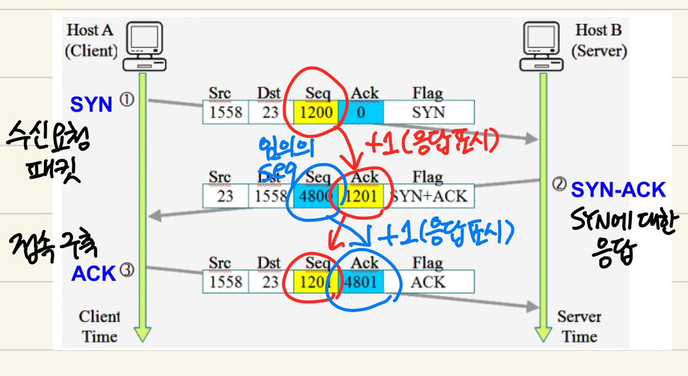

# 연결지향형 TCP 프로토콜

## TCP Protocol - Transmission Control Protocol
전송 제어 프로토콜은 인터넷에 연결된 컴퓨터에서 실행되는 프로그램 간에 통신을 **안정적으로, 순서대로, 에러없이** 교환할 수 있게 한다.

TCP의 안정성을 필요로 하지 않는 애플리케이션의 경우 일반적으로 TCP 대신 비접속형 사용자 데이터그램 프로토콜(UDP)를 사용한다.

TCP는 UDP보다 안전하지만 느리다는 단점이 있다.

- source port
- destination port
- sequence number
- acknowledgment number
- offset : 헤더의 길이
- reserved : 사용되지 않는 필드
- window : 데이터를 줄 때 보낼 데이터의 크기를 표시
- checksum
- tcp options

### tcp flags
- U: 긴급 bit(우선순위 높음)
- A: Ack bit(승인에 대한 응답)
- P: Push bit(데이터의 포화 여부에 상관 없이 전송, 우선순위 낮음)
- R: Reset bit(연결이 되어 있는 상태에서 문제가 발생했을 때 연결 관계 초기화)
- S: Syn bit(동기화 비트, 상대방과 연결을 할 때 무조건 사용)
- F: Fin bit(종료 비트)

## TCP를 이용한 통신 과정

### 3-Way Handshake
TCP를 이용한 데이터 통신을 할 때 프로세스와 프로세스를 연결하기 위해 가장 먼저 수행하는 과정

1. 클라이언트가 서버에게 요청 패킷 전송
2. 서버가 클라이언트의 요청을 받아들이는 패킷 전송
   - 1번 패킷에서 받은 Seq + 1을 Ack로 보냄(동기화)
3. 클라이언트가 이를 수락하는 패킷 전송
   - 2번 패킷에서 받은 Seq + 1을 Ack로 보냄
   - 2번 패킷에서 받은 Ack를 Seq로 보냄

이러한 3개의 과정을 **3-Way Handshake**라고 한다

### 데이터 송수신 과정

TCP를 이용한 데이터 통신을 할 때 단순히 TCP 패킷만을 캡슐화해서 통신하는 것이 아닌 페이로드를 포함한 패킷을 주고 받을 때의 일정한 규칙

1. 보낸 쪽에서 또 보낼 때는 Seq 번호와 Ack 번호가 그대로다
2. 받는 쪽에서 보내는 Seq 번호는 받은 Ack 번호가 된다
3. 받는 쪽에서 보내는 Ack 번호는 받은 Seq 번호 + 데이터 크기가 된다

## TCP 상태전이도

- LISTEN: 클라이언트와의 연결을 기다리는 상태
- ESTABLISHED: 클라이언트와 연결이 완료된 상태